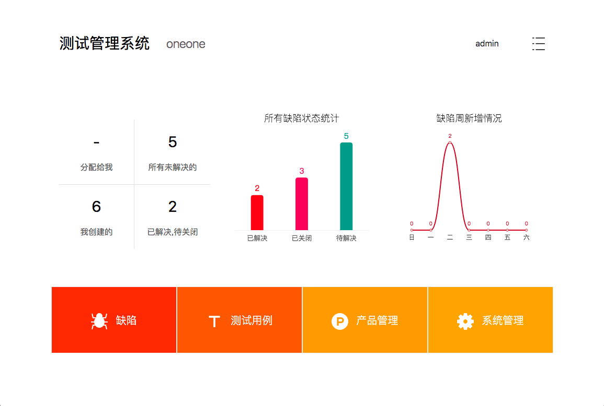

# HDesk

## 为什么做？
 这么多年，经历使用过`Bugzilla`、`TD`、`QC`、`Jira`、`Bugfree`、`Mantis`、`禅道`.....
 希望有一个：简单、轻便、优美、现代的测试管理工具

## 技术
 系统完全前后端分离
 - 前端: Vue + Nuxt + ElementUI + eCharts
 - 后端：Python3 + Django + Mysql + Nginx

## 功能
 目前主要实现了如下功能：
 - 缺陷管理 （缺陷列表、查询、搜索、新增、删除、编辑、分配、解决、关闭、重新打开、延期挂起、统计、分析等)
 - 测试用例管理 (测试用例创建、编辑、删除、评审、统计、运行)
 - 产品管理 （产品管理、版本管理、人员管理、模块管理）
 - 用户管理 （用户管理、增加、删除、修改密码）
 - 系统管理（api、page、日志管理）

## 安装
 安装文档见[INSTALL.md](INSTALL.md)
 ```
$ git clone git@github.com:HereDesk/HDesk.git
$ cd HDesk
$ npm install
$ npm install axios --save
$ npm install echarts --save
$ npm install element-ui --save
$ npm run dev 或者 nuxt dev
```
 接口见[HDesk-server](https://github.com/HereDesk/HDesk-server)

## 截图
 > 其它的截图见screenshot目录
 图一：（首页）
 

## 项目文件布局

采用nuxt标准的项目文件配置

```
.
├── .nuxt                                       // .nuxt编译目录
├── assets                                      // 资源目录 用于组织未编译的静态资源如(LESS、SASS 或 JavaScript)
├── components                                  // 组件目录
├── layouts                                     // 布局目录
├── middleware                                  // 中间件目录
├── plugins                                     // 插件目录
├── screenshot                                  // 存放页面截图
├── static                                      // 静态文件目录 static 用于存放应用的静态文件
├── store                                       // Vuex 状态树相关
├── pages                                       // 页面目录 pages 用于组织应用的路由及视图
│   ├── index.vue                               // 主入口页面
│   ├── error.vue                               // 错误页面
│   ├── app                                     // 应用
│   │   ├── help                                // 帮助
│   │   ├── products                            // 产品/项目
│   │   ├── qa                                  // QA
│   │   ├── set                                 // 设置
│   │   ├── system                              // 系统管理
│   │   ├── user-management                     // 用户管理
│   │   ├── dashboard                           // dashboard
├── nuxt.config.js                              // 用于组织Nuxt.js 应用的个性化配置
├── package.json                                // 文件用于描述应用的依赖关系和对外暴露的脚本接口
├── version.json                                // 版本号文件
├── ReleaseNote.md                              // 版本更新日志
├── README.md
```
